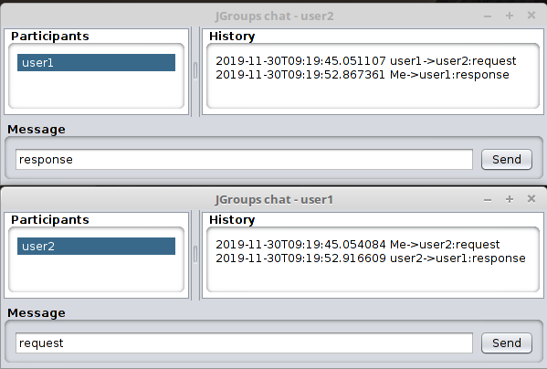

# JGroups chat

## Overview

This simple app can be used to test different JGroups configuration([http://www.jgroups.org/index.html]).

## Prerequisites

### to compile :
JDK 11, Maven 3+
initially tested with Open JDK 11.0.5

## to run:
JDK/JRE 11

## Usage

from command line:
    java -Xmx8M -jar jgroups_chat-1.0-SNAPSHOT-jar-with-dependencies.jar userName clusterName jgroupsConfigName
    
Parameters userName, clusterName and jgroupsConfigName are optional. They will be configured by default if they are omitted in cmd line.    
Parameter '-Xmx8M' is required to specify how much memory you will give to the java process. I recommend to specify some value because 
otherwise java will proceed with default size which is a quarter of physical memory (and it may be  too much for this app).

## Screeshots
   